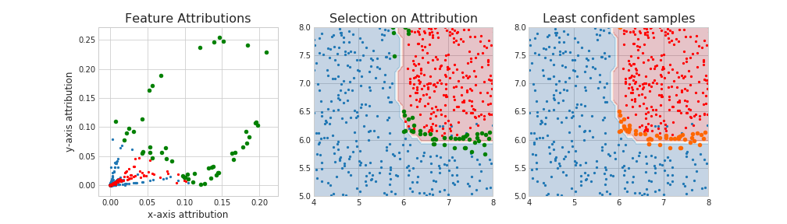

## apricot: submodular selection for machine learning

apricot is a package for the greedy selection of representative subsets of data from massive data sets using submodular selection, primarily for the purpose of training machine learning models in a fraction of the time. To this end, apricot contains implementations of *feature based functions* that scale to millions of samples and *facility location functions* that are less scalable but can be very powerful.

#### Installation

(not yet on PyPI)

`pip install apricot`

#### Fast subset selection for machine learning models

As data set size increases, so to do the computational requirements to train machine learning models. apricot allows you to select a diverse set of samples that train machine learning models well, with higher accuracy and more consistency than randomly selecting a subset would. When using a feature based function on the 20 newsgroups data set, one can train a logistic regression model using only 100 samples and get the same performance as using all 1,187 potential samples, much better than using random sampling.

#### Summarizing data sets by selecting examplars

apricot allows you to select exemplar samples from your data sets using facility location functions in a much more principled manner than simple random selection would allow. These exemplars can be used for downstream analysis, visualization in the place of large data sets, as centroids in a greedy version of k-means clustering, or as another approach for selecting subsets for training machine learning models. 

#### Model-based Exampler Selecting using Feature Attributions

While the primary use case of apricot is to select a subset of data independently from a model, apricot can also be merged with feature attribution methods in order to identify those samples that are deemed most important by a trained machine learning model. In this setting apricot can identify samples that lie on all parts of the decision boundary, whereas those samples that a model is least confident in tend to lie only on the most difficult part of the decision boundary.

