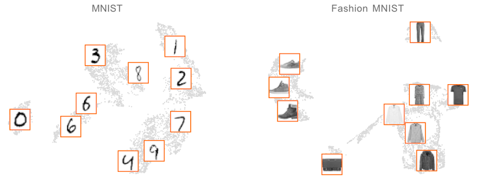

 [](https://apricot-select.readthedocs.io/en/latest/?badge=latest)

Please consider citing the [manuscript](https://jmlr.org/papers/volume21/19-467/19-467.pdf) if you use apricot in your academic work!

You can find more thorough documentation [here](https://apricot-select.readthedocs.io/en/latest/index.html).

apricot implements submodular optimization for the purpose of summarizing massive data sets into minimally redundant subsets that are still representative of the original data. These subsets are useful for both visualizing the modalities in the data (such as in the two data sets below) and for training accurate machine learning models with just a fraction of the examples and compute.



Submodular optimization is a well studied field that focuses on set functions which have the *diminishing return* property. These set functions have the dimishing return property, such that adding an item to a set produces a smaller marginal gain than adding the same item to a superset of that set. More formally, for <a href="https://www.codecogs.com/eqnedit.php?latex=\inline&space;X&space;\subseteq&space;Y" target="_blank"></a>, the property is <a href="https://www.codecogs.com/eqnedit.php?latex=\inline&space;f(X&space;&plus;&space;{v})&space;-&space;f(X)&space;\geq&space;f(Y&space;&plus;&space;{v})&space;-&space;f(Y)" target="_blank"></a>. When these functions represent a notion of diversity, finding the subset of examples that maximize these functions corresponds to finding a minimally redundant set. 

There are many built-in submodular functions and optimizers in apricot. These include:

**Functions**

* [Feature-based](https://apricot-select.readthedocs.io/en/latest/functions/featureBased.html)
* [Max (Set) Coverage](https://apricot-select.readthedocs.io/en/latest/functions/maxCoverage.html)
* [Facility Location](https://apricot-select.readthedocs.io/en/latest/functions/facilityLocation.html)
* [Graph Cut](https://apricot-select.readthedocs.io/en/latest/functions/graphCut.html)
* [Sum Redundancy](https://apricot-select.readthedocs.io/en/latest/functions/sumRedundancy.html)
* [Saturated Coverage](https://apricot-select.readthedocs.io/en/latest/functions/saturatedCoverage.html)
* [Mixtures of Functions](https://apricot-select.readthedocs.io/en/latest/functions/mixture.html)

**Optimizers**
* [Naive Greedy](https://apricot-select.readthedocs.io/en/latest/optimizers/naive.html)
* [Lazy Greedy](https://apricot-select.readthedocs.io/en/latest/optimizers/lazy.html)
* [Two-Stage Greedy](https://apricot-select.readthedocs.io/en/latest/optimizers/two-stage.html)
* [Approximate Lazy Greedy](https://apricot-select.readthedocs.io/en/latest/optimizers/approx-lazy.html)
* [Stochastic Greedy](https://apricot-select.readthedocs.io/en/latest/optimizers/stochastic.html)
* [Sample Greedy](https://apricot-select.readthedocs.io/en/latest/optimizers/sample.html)
* [GreeDi](https://apricot-select.readthedocs.io/en/latest/optimizers/greedi.html)
* [Modular Approximation](https://apricot-select.readthedocs.io/en/latest/optimizers/modular.html)
* [Bidirectional Greedy](https://apricot-select.readthedocs.io/en/latest/optimizers/bidirectional.html)

### Installation

apricot can be installed easily from PyPI with `pip install apricot-select`

### Usage

The main objects in apricot are the selectors. Each selector encapsulates a submodular function and the cached statistics that speed up the optimization process. The API of the selectors follows the style of a scikit-learn transformer and consists of a `fit` method, where the examples are selected, a `transform` method, where the subset is selected from the data set, and a `fit_transform` method, where both are done sequentially.

Here is an example of reducing a data set of size 5000 down to 100 examples with a facility location function that uses negative Euclidean distance as a similarity measure. 

```python
import numpy
from apricot import FacilityLocationSelection

X = numpy.random.normal(100, 1, size=(5000, 25))
X_subset = FacilityLocationSelection(100, metric='euclidean', optimizer='lazy').fit_transform(X)
```

#### Facility location functions are general purpose

Facility location functions are more general purpose than feature based functions and work whenever a similarity measure can be defined over pairs of examples. When these functions are maximized, elements are selected that represent elements that are currently underrepresented. However, a downside of facility location functions (and all other submodular functions that rely on a similarity matrix) when compared to feature based functions is that the full similarity matrix requires quadratic memory with the number of examples and is generally impractical to store.

Here is an example of applying facility location selection to the MNIST data set.

```python
from apricot import FacilityLocationSelection
from sklearn.datasets import load_digits

data = load_digits()
X_train = data.data[:1250]

selector = FacilityLocationSelection(n_samples, metric='euclidean', optimizer='lazy', verbose=False)
selector.fit(X_train)
```
And here is the performance of logistic regression models trained on subsets of either the MNIST or Fashion MNIST data sets where the subsets are selected using either facility location (orange) or random selection (grey).


The selected examples from facility location selection can be used in several ways other than training machine learning models, such as for visualizing the modalities of data (see the example at the start) or as centroids in a greedy version of k-means clustering. The animation below shows samples being selected according to facility location and compared to random selection, with facility location first selecting a sample that represents the entire data set, then selecting a sample that is in the largest cluster but near the second largest, and then the centers of local neighborhoods. This selection process is much faster than finding centroids using the EM based approaches of K-means or GMMs.


#### Feature based functions scale to summarize massive data sets

Feature-based functions work well when the features correspond to some notion of quantity or importance, e.g. when the features are number of times a word appears in a document, or the strength of a signal at a sensor. When these functions are maximized, the resulting subsets are comprised of examples that are enriched in value in different sets of features. The intuition behind using a feature-based function is that different modalities in the data (like classes or clusters) will exhibit high values in different sets of features, and so selecting examples enriched for different features means covering these modalities better. 

When using a feature-based function on the 20 newsgroups data set, one can train a logistic regression model using only 100 samples and get the same performance as using all 1,187 potential samples, much better than using random sampling. The code below shows an example snippet of code usage and the graph shows the results over many subset sizes.

```python
from apricot import FeatureBasedSelection
from sklearn.datasets import fetch_20newsgroups
from sklearn.feature_extraction.text import TfidfVectorizer

train_data = fetch_20newsgroups(subset='train', categories=('sci.med', 'sci.space'))
vectorizer = TfidfVectorizer(stop_words='english', max_features=1000)

X_train = vectorizer.fit_transform(train_data.data) # This returns a sparse matrix which is supported in apricot

selector = FeatureBasedSelection(100, concave_func='sqrt', optimizer='two-stage', verbose=False)
selector.fit(X_train)
```


#### Initial subsets

The selection process for most optimizers implemented in apricot is greedy, meaning that one example is selected at a time and this is (usually) the best example to include next given those that have already been selected. While a greedy algorithm is not guaranteed to find the best subset of a given size, it was famously shown that this subset cannot have an objective value $1 - e^{-1}$ worse than the optimal subset, and in practice the subsets are usually near-optimal.

apricot exploits the greedy aspect of the algorithms to allow users to define an initial subset to build off of. This can be useful when one already has some elements selected (such as by outside information) and one would like to select elements that are not redundant with these already-selected elements. The initial subsets can be defined in the constructor like so: 

```python
import numpy
from apricot import FacilityLocationSelection

X = numpy.random.normal(20, 1, size=(5000, 25))
X_reordered = FacilityLocationSelection(100, initial_subset=[1, 5, 6, 8, 10]).fit_transform(X)

model = FacilityLocationSelection(1000).fit(X)
X_reordered2 = X[model.ranking]
```

#### When should I use submodular selection?

If the amount of data that you have right now is not burdensome to deal with then it may not be helpful to use submodular selection. However, if training even simple models using the amount of data you have is difficult, you might consider summarizing your data set using apricot. If you're currently running many random selections because of the amount of data you have you may find that a single run of apricot will yield a better subset.

