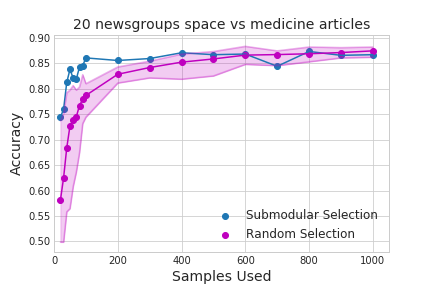
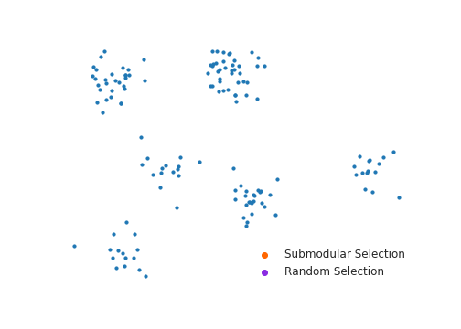

## apricot: submodular selection for machine learning

[](https://travis-ci.org/jmschrei/pomegranate)

apricot is a package for the greedy selection of diverse subsets of data from massive data sets using submodular selection. While there are many uses of a diverse subset of data, the primary goal of apricot is to yield subsets that yield accurate machine learning models with just a fraction of the samples. To this end, apricot implements **feature based functions** that easily scale to millions of examples and **facility location functions** that are slower but are more broadly applicable. These functions are agnostic to the machine learning model that will eventually be used and so apricot can be dropped in to your system with minimal interference. apricot uses numba to accelerate its computationally intensive aspects and many algorithmic optimizations to be orders of magnitude faster than a simple NumPy implementation of the same functions.

#### Installation

apricot is on PyPI!

`pip install apricot-select`

If you get an error that looks like 

```Inconsistency detected by ld.so: dl-version.c: 224: _dl_check_map_versions: Assertion `needed != NULL' failed!``` 

or a segmentation fault when importing apricot for the first time then you should try reinstalling numba through conda using 

```conda install numba```.

or

```pip install numba==0.39.0```

The issue appears to be with the most recent verson of numba, v0.40.0. Downgrading to numba v0.39.0 should solve the issue. 

### Usage

apricot has a simple API that was built in the style of a sklearn transformer. Accordingly, the API consists of a `fit` method where the ranking of samples is determed, a `transform` method that applies this ranking to the data set, and a `fit_transform` method that takes in a large data set and returns the subset. If you'd like to reduce your data set from 1000 samples to 100 you can do the following:

```
import numpy
from apricot import FacilityLocationSelection

X = numpy.random.normal(100, 1, size=(1000, 25))
X_subset = FacilityLocationSelection(100).fit_transform(X)
```

Because the selection process is greedy, one can use these algorithms to rank an entire data set according to the gain in diversity according to the function. The returned set is in the order of this ranking with the first sample having the largest marginal gain at the beginning and the last sample having the smallest marginal gain at the end, or you can use the ranking attribute. 

```
import numpy
from apricot import FacilityLocationSelection

X = numpy.random.normal(20, 1, size=(1000, 25))
X_reordered = FacilityLocationSelection(1000).fit_transform(X)

model = FacilityLocationSelection(1000).fit(X)
X_reordered2 = X[model.ranking]
```

Feature based functions can be used similarly.

```
import numpy
from apricot import FeatureBasedSelection

X = numpy.random.normal(20, 1, size=(1000, 25))
X_subset = FeatureBasedSelection(100).fit_transform(X)
```

#### Feature based functions quickly select subsets for machine learning models

```FeatureBasedSelection(n_samples, concave_func='sqrt', n_greedy_samples=3, verbose=False)```

Feature based methods work well when the features correspond to some notion of quantity or importance. For example, when the features are number of times a word appears in a document, or the strength of a signal at a sensor. These functions then attempt to select samples that show a diversity in the features which exhibit large values, ensuring that large values are seen in as many features as possible. When using a feature based function on the 20 newsgroups data set, one can train a logistic regression model using only 100 samples and get the same performance as using all 1,187 potential samples, much better than using random sampling.



#### Facility location functions work in a variety of situations

```FacilityLocationSelection(n_samples, pairwise_func='euclidean', n_greedy_samples=1, verbose=False)```

Facility location functions are more general purpose and work in any situation in which a similarity can be defined over pairs of samples. These functions then attempt to identify samples that are representative of those samples who are least similar to the currently identified samples. However, because one needs to define a similarity between all pairs of samples, these algorithms take memory that is quadratic with the number of samples. However, apricot allows you to pass in a sparse matrix and gives corresponding speed gains when not all pairs of samples need to be considered.

These exemplars can be used for a variety of tasks, including selecting subsets for training machine learning models, visualization in the place of large data sets, or as centroids in a greedy version of k-means clustering. The animation below shows samples being selected according to facility location and compared to random selection, with facility location first selecting a sample that represents the entire data set, then selecting a sample that is in the largest cluster but near the second largest, and then the centers of local neighborhoods.



#### scikit-learn integration

Because apricot implements these functions in the style of a scikit-learn transformer, they can be dropped into current workflows. Clustering models that used to be defined as follows:

```
model = GaussianMixture(10)
model.fit(X)
```

can now be turned into a pipeline without changing the rest of your code like such:

```
model = Pipeline([('selection', FacilityLocationSelection(25)),
                  ('model', GaussianMixture(10))])
model.fit(X)
```

sklearn does not currently allow transformers to modify the label vector y even though they can modify the data matrix X and so apricot cannot be dropped into pipelines for supervised models. However, if you are not constrained to use a pipeline then you can transform both the data matrix and the label vector together:

```
X_subset, y_subset = FacilityLocationSelection(100).fit_transform(X, y)
model.fit(X_subset, y_subset)
```

#### When should I use submodular selection?

If the amount of data that you have right now is not burdensome to deal with then it may not be helpful to use submodular selection. However, if training even simple models using the amount of data you have is difficult, you might consider summarizing your data set using apricot. If you're currently running many random selections because of the amount of data you have you may find that a single run of apricot will yield a better subset.

Areas that we are hoping to explore further with apricot:

* subset selection on feature attributions rather than feature values to identify a model-based summary of the data
* subset selection on the internal representations of samples in a neural network
* discriminative subset selection when given a data set and associated labels
* model-guided subset selection for accelerating transfer learning
