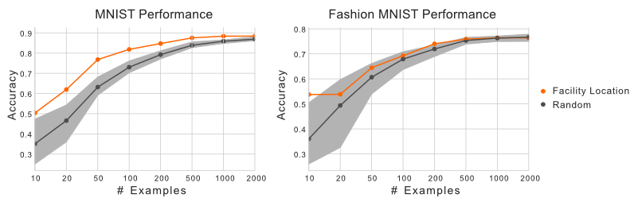

.. image:: logos/apricot-logo.png
	:width: 500px

|
 
.. image:: https://travis-ci.org/jmschrei/apricot.svg?branch=master
	:target: https://travis-ci.org/jmschrei/aprico

.. image:: https://readthedocs.org/projects/apricot-select/badge/?version=latest
   :target: http://apricot-select.readthedocs.io/en/latest/?badge=latest

|

apricot is a package for submodular optimization brought to you in a convenient sklearn-like format. The package focuses on (1) being flexible enough for allow users to easily define their own functions and optimizers just as you can in neural network libraries, and (2) being fast by using numba to speed up the computationally intensive aspects.

The primary purpose of apricot is to summarize massive data sets into useful subsets. A simple way to use these subsets is to visualize the modalities of data. When apricot is used to summarize the MNIST and Fashion-MNIST data sets into ten elements, those selected represent the space well and cover almost all the classes without even having access to the labels.

.. image:: imgs/embeddings.png
   :width: 1000px

These subsets can also be useful when training machine learning models. It might seem counterintuitive at first to train a model using only a fraction of your data. Unfortunately, the compute required to train models on huge data sets might not be available to everyone. Instead of relying on random subsampling, one could instead select a subset using submodular optimization. Using the same data sets as before, we can see that training a logistic regression model using the subsets selected by apricot results in a model with higher accuracy than randomly selected subsets.

|

At a high level, submodular functions operate on sets of elements and optimizing them involves selecting a subset of elements. The functions implemented in apricot return a value that is inversely related to the redundancy of the selected elements, meaning that maximizing them involves selecting a set of non-redundant elements. A key property of these functions is that they are *submodular*, meaning that the gain in the function value that a particular element would yield either decreases or stays the same each time an element is added to the subset (this is also known as the diminishing returns property). 

You can install apricot with :code:`pip install apricot-select`.

.. toctree::
   :maxdepth: 1
   :hidden:
   :caption: apricot

   Introduction <self> 
   submodular.rst
   CODE_OF_CONDUCT.rst
   faq.rst
   whats_new.rst

.. toctree::
	:maxdepth: 1
	:hidden:
	:caption: Features

	features/sparse.rst
	features/knapsack.rst

.. toctree::
   :maxdepth: 1
   :hidden:
   :caption: Functions

   functions/featureBased.rst
   functions/maxCoverage.rst
   functions/facilityLocation.rst
   functions/graphCut.rst
   functions/sumRedundancy.rst
   functions/saturatedCoverage.rst
   functions/mixture.rst

.. toctree::
   :maxdepth: 1
   :hidden:
   :caption: Optimizers

   optimizers/naive.rst
   optimizers/lazy.rst
   optimizers/two-stage.rst
   optimizers/approx-lazy.rst
   optimizers/stochastic.rst
   optimizers/sample.rst
   optimizers/greedi.rst
   optimizers/modular.rst
   optimizers/bidirectional.rst
